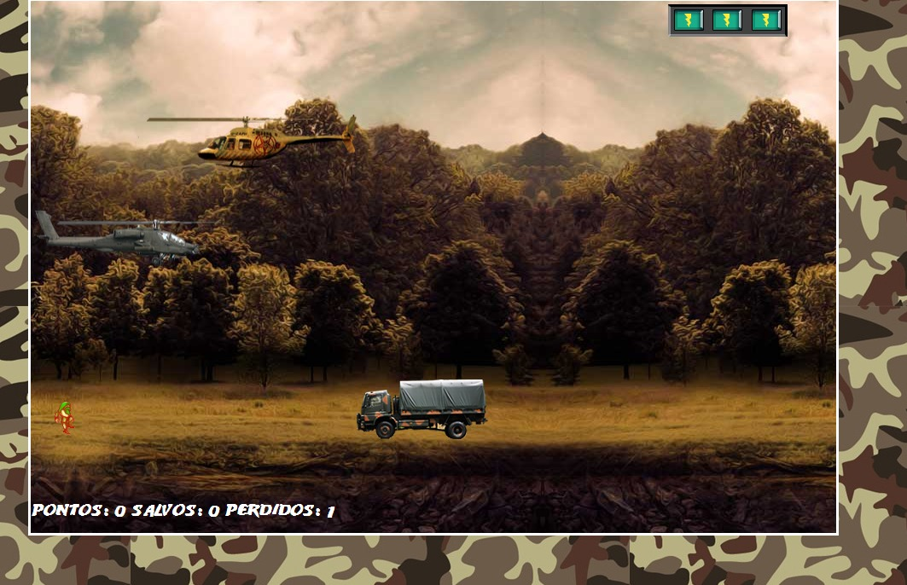

## Resgate

### Descrição do projeto
Neste projeto, desenvolvi um jogo de naves utilizando HTML, CSS, Javascript e os frameworks jQuery e jQuery Collision (para indentificar colisões entre divs, ótimos para jogos em duas dimensões).

O jogo consiste em controlar um helicóptero e tentar resgatar um fugitivo (seu amigo) destruindo o helicóptero inimigo e sem deixar que ele seja atropelado pelo caminhão.

A cada helicóptero inimigo que você destruir com disparos você ganha 100 pontos e a cada caminhão destruído com disparos você ganha 50 pontos.

Caso você salve o seu amigo (direcionando seu helicóptero até ele) é você ganha mais um na pontuação "salvos". Caso contrário (seu amigo seja atropelado) é acrescido em um a pontuação "perdidos".

O jogador começa com 3 energias e, a cada colisão que ele tiver com os inimigos, ele perde uma energia, até que, a quantidade de energia seja 0 e ele perca o jogo.

### Para rodar o projeto
Para executar o projeto, basta apenas abrir o arquivo index.html em um navegador de preferência.

